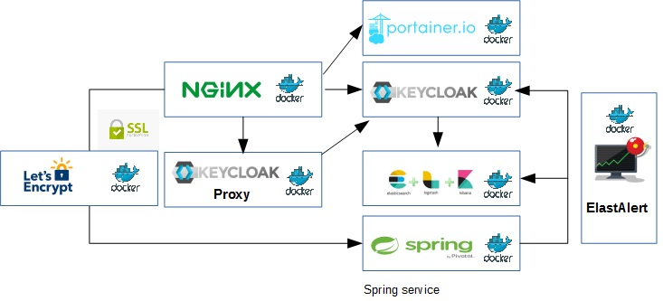

# elk-secure-docker-compose

# Context

The Elastic stack or [ELK](https://www.elastic.co/products/) "lets you reliably and securely take data from any source, in any format, and search, analyze, and visualize it in real time". ELK is composed by [Elasticsearch](https://www.elastic.co/products/elasticsearch), [Logstash](https://www.elastic.co/products/logstash) and [Kibana](https://www.elastic.co/products/kibana). We need to comply with the following requirements to use Open Source Kibana version in production:
- Unless you get the corresponding license, it [does not support Authentication](https://www.reddit.com/r/devops/comments/5n6viw/elk_5x_without_a_license_no_xpack/?depth=2), so [KeyCloak IdM and proxy](https://aboullaite.me/secure-kibana-keycloak/) is used to redirect to login and password page before accessing the dashboard.
- [Integrated alerting rules are needed](https://bitsensor.io/blog/elastalert-kibana-plugin-centralized-logging-with-integrated-alerting/) so [ElastAlert](https://github.com/bitsensor/elastalert#installation) is also installed with the [suitable Kibana plugin](https://github.com/bitsensor/elastalert-kibana-plugin) to be integrated with the dashboard.

Finally https is provided by means of an [nginx reverse proxy]().

# Description

The repository provides the docker compose scripts to provide an ELK installation ready for production. It provides https through nginx as reverse proxy and authentication by means of KeyCloak IdM and Proxy.
The software is prepared for production with the following architecture (letsencrypt for https). KeyCloak Proxy is used to foce Kibana access to login through the Identity Management (KeyCloak):

<p align="center">
	
</p>

Nginx is used as reverse proxy. For testing, port 80 and simple names are used: keycloak, monitor (with keycloak proxy redirection to kibana dashboard) and portainer. For production the port must be changed to 443, and letsencrypt must be used to provide the https certs. You should change the suitable domains and configuration details in the .env file and uncomment docker-compose.yml code before deploying the containers.

# Technologies and tools

- Docker compose
- Elasticsearch
- Logstash
- Kibana
- KeyCloak IdM and Proxy
- MySQL
- Nginx as reverse proxy and letsencrypt
- Portainer

# How to deploy

[Install Docker CE](https://docs.docker.com/install/). For Windows and Mac a [docker toolbox desktop is available](https://docs.docker.com/toolbox/overview/). Remember that Docker toolbox is published at 192.168.100.99 (`user: docker, password: tcuser`)

**Tip**: To avoid performance issues, increment VirtualBox default VM memmory to 4g

Deploy using docker-compose:

```
Stop and remove the containers
docker-compose down

Launch the containers (dettached)
docker-compose up -d
```

**IDENTIFIED ERRORS**

- [Elasticsearch insufficient memmory](https://github.com/docker-library/elasticsearch/issues/133). "max virtual memory areas vm.max_map_count [65530] likely too low, increase to at least [262144]".

  **Solution**, In the docker host execute `sysctl -w vm.max_map_count=262144`

- [Kibana plugin install stalls at `Optimizing and caching browser bundles...`](https://github.com/elastic/kibana/issues/19678)

  **Solution**, add `NODE_OPTIONS="--max-old-space-size=4096"` to Kibana container as environment variable.

- [The elastalert plug in is not showing up in Kibana UI for 6.5.4](https://github.com/bitsensor/elastalert-kibana-plugin/issues/86)

  **Solution**, downgrade to Kibana version 6.4.2.

# How to use

[Environments](https://docs.docker.com/compose/environment-variables/) are used to configure the installation. Modify the `.env` to comply your needs.

To access Kibana, firstly you need to validate with a user and password created in KeyCloak and assigned to a realm. To configure the realm on KeyCloak access to:

```
	http://localhost:8080/ (or http://keycloak/)
```

- Login with `user: admin password: Pa55w0rd` (if needed, modify the `.env` file to change the values). 
- Create a realm `kibana`, with a client id `kibana`. 
- Be sure to fill in Valid Redirect URI to `http://localhost:8080/*` (or `http://keycloak/*`). 
- Create a user in the new realm for testing, for instance `kibana`.

Then you can access to Kibana through the proxy:
```
    http://localhost:8081 (or http://monitor)
```

The nginx reverse proxy allows also accessing using domains: monitor, portainer and keycloak (if you redirect the domains to localhost or the IP where you are deploying the containers).

**Tip**: if you are using Docker toolbox point the domains to IP 192.168.99.100.

```
192.168.99.100 keycloak
192.168.99.100 monitor
```

# How to contribute

Features and bug fixes are more than welcome. They must be linked to an issue, so the first step before contributing is the creation of a [GitHub issue](https://github.com/arihealth/elk-secure-docker-compose/issues).

# External resources

- [How to secure Kibana with Keycloak](https://aboullaite.me/secure-kibana-keycloak/)
- [ElastAlert to integrate alerting inside Kibana](https://bitsensor.io/blog/elastalert-kibana-plugin-centralized-logging-with-integrated-alerting/)

# License

Apache 2.0.

